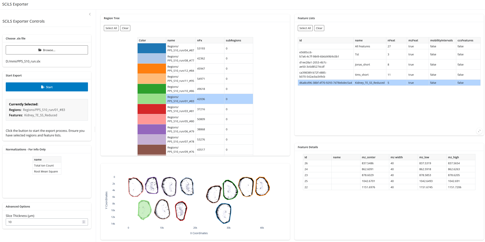

# slx2imzml

A Python package for converting SCiLS Lab files (.slx) to open-standard imzML files for mass spectrometry imaging (MSI) data analysis.



## Overview

This package reads proprietary SCiLS Lab files and exports regions as accessible imzML files that are compatible with [M²aia](http://m2aia.de) and other open-source MSI analysis tools. The tool provides both an interactive Graphical User Interface (GUI) and a Command Line Interface (CLI) for flexible workflows.

## Features

- **Interactive GUI**: User-friendly interface for browsing datasets, visualizing regions, and selecting feature lists.
- **Multi-format Export**: Converts SCiLS Lab regions to imzML format with continuous profile/centroid spectrum support.
- **Spatial Visualization**: Preview region polygons overlaid on optical overview images.
- **Feature Inspection**: Detailed view of m/z features with calculated center mass and ppm width.
- **Additional Outputs**: Exports spot images (TIC, normalizations), optical images, and region masks as NRRD files.
- **M²aia Compatibility**: Generated imzML files are fully compatible with M²aia software.

## Installation

### Prerequisites

- Python ≥ 3.6
- **SCiLS Lab Python API**: This is a proprietary library from Bruker. You must install the `.whl` package provided by Bruker or located in this repository.

### Install from Source

```bash
git clone <repository-url>
cd slx2imzml
pip install -e .
```

This command will install the `slx2imzml` package and all its dependencies, including the GUI components.

## Usage

### Graphical User Interface (Recommended)

To start the interactive exporter, run:

```bash
slx2imzml-gui
```

1. **Browse**: Select your `.slx` file.
2. **Select**: Choose the regions and feature lists you wish to export. You can preview the spatial regions in the plot.
3. **Configure**: Set the slice thickness in the advanced options.
4. **Export**: Click "Start" to begin the conversion.

### Command Line Interface

For batch processing or automation, you can use the CLI:

```bash
python -m slx2imzml export_instructions.json
```

Refer to the section below for details on the JSON configuration.

### Export Instructions Format

Create a JSON configuration file to specify export parameters for the CLI:

```json
{
  "description": "Export configuration for SCiLS to imzML conversion",
  "slice_thickness": 10,
  "data_exports": [
    {
      "filename": "path/to/your/file.slx",
      "final_features": [],
      "final_regions": [["Region1", "region_id_1"]],
      "final_spot_images": ["normalization1", "normalization2"],
      "final_optical_images": ["optical1"],
      "final_labels": [],
      "final_regions_as_labels": []
    }
  ]
}
```


## File Structure

```
slx2imzml/
├── slx2imzml/              # Core conversion package
│   ├── ImzMLIO.py          # Main conversion logic
│   ├── ImzMLWriter.py      # imzML file writing utilities
│   ├── slxFileHelper.py    # SCiLS Lab data access helpers
│   └── imzMLTemplate.j2    # Jinja2 template for imzML XML
├── slx2imzml_gui/          # GUI application
│   ├── app.py              # PyShiny application logic
│   └── launcher.py         # Entry point for slx2imzml-gui
└── assets/                 # Documentation assets (screenshots)
```

## Contributing

This project is developed at Hochschule Mannheim in connection with the M²aia project for open-source mass spectrometry imaging analysis.

## License

MIT License - See LICENSE file for details.